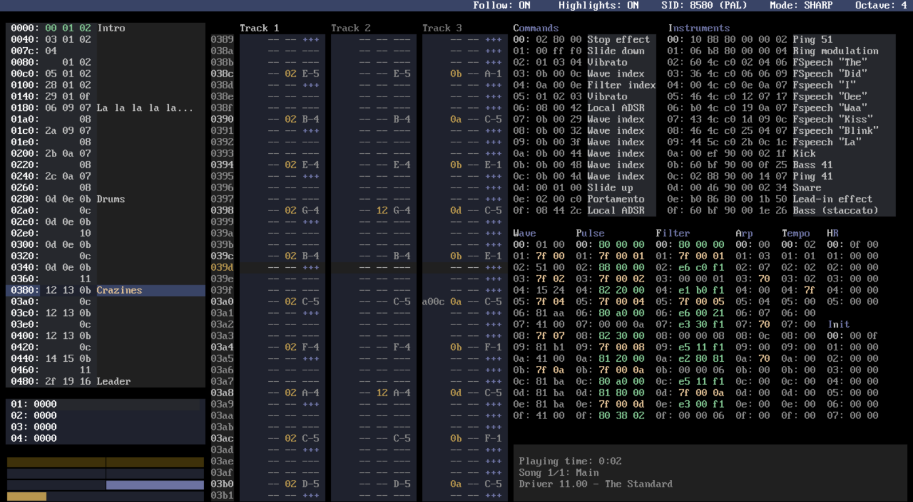

# SID Factory II

SID Factory II is a cross-platform editor for composing music that will work on
a Commodore 64. It uses the reSID emulator.
To build from source, have a look [here](DEVELOPMENT.md).

Main programming by Thomas Egeskov Petersen, with assistance by Jens-Christian
Huus and Michel de Bree.

Notable features:

- Uses the renowned reSID emulator
- Tracker-like interface, using JCH's contiguous sequence stacking system and
  Protracker note input layout.
- Choice of various music drivers made by pioneer musicians
  [Laxity](https://deepsid.chordian.net/?file=/MUSICIANS/L/Laxity) and
  [JCH](https://deepsid.chordian.net/?file=/MUSICIANS/J/JCH) ,
  optimized for use in demos and games on the Commodore 64.
- Imports Goattracker, CheeseCutter and MOD files.
- Supports both SID models 6581 and 8580 for PAL and NTSC.
- Unlimited undo
- Multiple songs
- Copy / paste and modify selected area
- Built-in packer and relocator to position the music anywhere in the Commodore
  64 memory. Relocate used zero page addresses.
- Includes demo tunes to learn from.
- Cross platform: Windows, macOS (Intel and ARM) and Linux versions.
- Configurable settings, shortcuts and keyboard layout
- Open source

## Changelog

This is a fork from the official repository to make it easier for me to do quick
test releases with previews for new functionality. Some features might not make it
into the official version, and some might.

I am a macOS user myself, so this fork is only tested on macOS.

### Next release

- SDL2 upgraded to 2.32.10 (Windows and macOS, thanks to
  [realdmx](https://github.com/realdmx) for the Windows upgrade)
- Added [#4](https://github.com/micheldebree/sidfactory2/issues/4) Support for C64 font.
  This can be selected with the new `Window.Font` configuration option.
- Added [#190](https://github.com/Chordian/sidfactory2/issues/190)
  Configuration options
  for setting the limits of rastertime usage used to color frames orange or red in
  the flightrecorder.
  `Visualizer.CPU.Medium.Rasterlines` and `Visualizer.CPU.High.Rasterlines`
- Added: [#183](https://github.com/Chordian/sidfactory2/issues/183) Toggle fullscreen with ALT-Enter
- Added: [#183](https://github.com/Chordian/sidfactory2/issues/183) Config option `Window.FullScreen`
  to start in fullscreen by default
